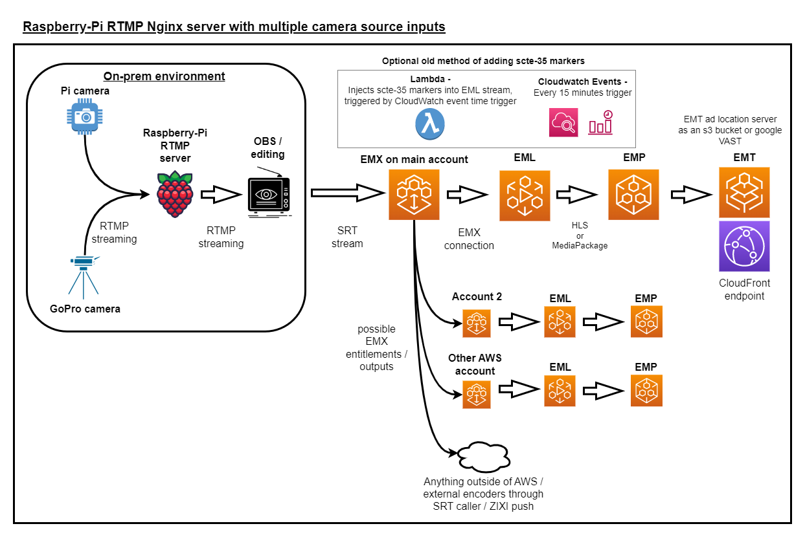

# RaspberryPi-streaming-workflow
Rpi AWS streaming



- NGINX RMTP server is only needed when you want to use Raspberry-pi as a server for multiple source streams. If you only want to stream from the Raspberry-Pi and no other sources at the same time, you can skip the NGINX server section and start at the raspivid-ffmpeg command section to start that single stream from the Rpi camera.

## Raspberry pi and other camera source (GoPro etc..)

### Devices:
- Raspberry Pi 3b+ (Nginx RTMP server)
- Raspberry Pi Camera-v2 (old, but still works)
- GoPro 11 (7 or newer works, as long as it can stream RTMP)
- Works with as many camera devices as the Rpi can handle (mem/cpu/network constraints)

### Raspberry Pi setup:	
	
1. Enable Pi camera in raspi-config
2. Install Nginx
3. Edit the `etc/nginx/nginx.conf` file
    - Add in RTMP server section
    - Add an application for each app name you want

Edit nginx.conf

```
rtmp {
	server {
		
		listen 1935;
		chunk_size 4000;

		application gopro {
			live on;
			record off;
		}

		application raspivid {
			live on;
			record off;
		}
	}
}

```

- Start stream by piping raspivid video commmand into ffmpeg rtmp stream command 
```
raspivid -n -t 0 -w 1280 -h 360 -fps 24 -b 600000 -o - | ffmpeg -i - -vcodec copy -an -f flv rtmp://127.0.0.1:1935/raspivid/live
```

To watch stream ==<br>
Stream from VLC or OBS :: (rtmp://10.170.1.106:1935/raspivid/live)<br>
10.170.1.106 == IP of raspberry PI</p>

## OBS

OBS is used for on-prem scene switching IF desired, you can switch between the multiple input source (Rpi, GoPro, other camera, smart phone)

- `Input source` = `rtmp://10.170.1.106:1935/raspivid/live`
- `stream` SRT to MediaConnect `srt://54.243.173.27:5010`   (IP is inbound IP of MediaConnect flow)

## Media Connect

MediaConnect is used to connect an exernal stream into AWS and pass it off to MediaLive or even other accounts through entitlements.

- SRT flow from OBS

`Source details` - 
Standard source
Port 5000

`Output details` - NONE needed, MediaLive input has a native Mediaconnect flow connection.

- Useful metrics

`Packet` and `network` metrics are most useful for EMX because EMX is just a passthrough service, it does not "manipulate" or change the stream in anyway.

## Media Live

MediaLive allows for creation of multiple resolutions/bitrates for a stream. This allows for adaptive bitrate streaming.<br>

Configuration -

- Input Setup

- Takes MediaConnect as direct MediaConnect connection instead of SRT

`Input details` - MediaConnect flow

- Channel Setup

`output groups` = Make 1 output group withe 1 - 3 outputs depending on which resolution packages you desire in the end.
SCTE-35 passthrough must be enabled to pass the scte-35 markers through, so they exist for ad-insertion to use.

For example --

Output 1 =<br>
PID settings -<br>
`SCTE-35 Behavior` - Passthrough<br>
Video -<br>
1280w x 720h<br>
`codec` - H264<br>
`rate control mode` - 3800000<br>
Additional settings -<br>
`Max bitrate` - 3800000<br>
`QVBR Quality level` - 8<br>

Output 2 =<br>
PID settings -<br>
`SCTE-35 Behavior` - Passthrough<br>
Video -<br>
960w x 540h<br>
`codec` - H264<br>
`rate control mode` - 2300000<br>
Additional settings -<br>
`Max bitrate` - 2300000<br>
`QVBR Quality level` - 7<br>

Output 3 =<br>
PID settings -<br>
`SCTE-35 Behavior` - Passthrough<br>
Video -<br>
640w x 360h<br>
`codec` - H264<br>
`rate control mode` - 1200000<br>
Additional settings -<br>
`Max bitrate` - 1200000<br>
`QVBR Quality level` - 6<br>

## Media Package

MediaPackage combines all the different MediaLive resolution renditions into 1 packaged endpoint.<br>
Also, MediaPackage can create different package renditions such as:
- Live 30-second delay
- Startover feature (rewind) feature

`Input` = MediaLive channel

`channel` = ABR or whichever with required resolution and bitrates

SCTE-35 passthrough must be enabled to pass the scte-35 markers through, so they exist for ad-insertion to use.

`endpoint` = Ad markers - PASSTHROUGH (this is to pass the scte-35 markers from MediaLive to MediaTailor so MediaTailor can see the markers).

## Media Tailor

MediaTailor is used for ad-insertion in AWS. Server-Side Ad Insertion (SSAI) gives you the ability to use an external ad provider to insert ads.

- Configuration setup

`Video Content source` = MediaPackage endpoint WITHOUT the manifest at the end of it /index.m3u8

ADS = How ads are inserted. VAST files have predetermined times, durations, and video clip location URL's for the ads.

`ADS` = google VAST or VAST file in s3

ADS = How ads are inserted. VAST files have predetermined times, durations, and video clip location URL's for the ads.

Google has free VAST templates which include different timings for the ads. For exmaple, there can be a pre-roll(ad at start of stream, mid-roll(ad somewhere in the middle of stream and post-roll(ad at the end of a stream) mapped out in the same VAST file.

Google VAST - single inline ad = "https://pubads.g.doubleclick.net/gampad/ads?iu=/21775744923/external/single_ad_samples&sz=640x480&cust_params=sample_ct%3Dlinear&ciu_szs=300x250%2C728x90&gdfp_req=1&output=vast&unviewed_position_start=1&env=vp&impl=s&correlator="

`slate ad` = "http://d2qohgpffhaffh.cloudfront.net/MediaTailor/AWSE_Logo_15sec.mp4" (any slate ad for when a real ad fails)

From = https://developers.google.com/interactive-media-ads/docs/sdks/html5/client-side/tags

NOTE -- with simple VAST template, you must store the ad video clips in an s3 bucket for access and reference those video clips in the VAST template

- Example [SIMPLE VAST template](assets/adTestnewer.xml)

- Come back and plug in CloudFront CDN settings once the CloudFront distribution has been created

#### MediaTailor CDN connection configuration

`CDN content segment prefix` -
Includes both the CloudFront and MediaPackage endpoint combined:
For example: https://d32ftvdskdjq4u.cloudfront.net/out/v1/96e862ec32d548fabad6436ad4fe0285

`CDN ad segment prefix` -
CloudFront domain name:
For example: https://d3f1234jq4u.cloudfront.net

#### MediaTailor Metrics

LOG INSIGHTS -->

- log insights query to filter by STATUSCODE<br>
fields @timestamp, StatusCode, @message, @logStream, @log<br>
| sort @timestamp desc<br>
| filter originId like /SSARFrance20tteConfiguration/<br>
| stats count() by StatusCode<br>

## Cloudfront

CloudFront is a global content delivery network that improves latency for end user requets and also caches requests.

CloudFront origins and paths -<br>

- Origins

| Origin | Origin domain name | Query String Forwarding and Caching |
| ----------- | ----------- | ----------- |
| MediaPackage Origin         | (eg. 547f72e6652371c3.mediapackage.us-west-2.amazonaws.com) | Forward all, cache based on all |
| MediaTailor Origin           | HLS playback URL -- | Forward all, cache based on all |
| MediaTailor ad server hostname    | segments.mediatailor.us-east-1.amazonaws.com | Forward all, cache based on all | 

`MediaTailor origin domain name` - HLS Playback Prefix (the name of the EMT configuration) (e.g. f445cfa805184f3e8d86dc2ac1137efa.mediatailor.us-west-2.amazonaws.com)<br>
`MediaPackage origin domain name` - MediaPackage endpoint<br>
`MediaTailor ad server hostname` - Ad segment routing endpoint for the region

- Path patterns

| Precedence | Path Pattern | Origin or Origin Group | Viewer Protocol Policy | Query String Forwarding and Caching |
| ----------- | ----------- | ----------- |  ----------- | ----------- |
| 0    | /out/v1/*    | MediaPackage Origin | HTTP and HTTPS | YES forward all |
| 1    | /v1/*        | MediaTailor Origin | HTTP and HTTPS | YES forward all |
| 2    | Default(*)   | segments.mediatailor.us-east-1.amazonaws.com | HTTP and HTTPS | YES forward all |

Best practices for personalization of manifests through a CDN:
- Forward all query strings so the ADS knows exactly which ads to insert based on which viewer/user is requesting for personalized ads.
- Forward the User-Agent header.


## SCTE-35 marker insertion

- Older way of scte-35 insertion was to use a Lambda function that inserted a splice-insert command into the MediaLive schedule.

- CloudWatch Event scheduling can now call the MediaLive API from CloudWatch Events, negating the need for a custom written Lambda function.

CloudWatch EventBridge --
- Make event based on a Recurring schedule (every 15 minutes)

## SECURITY <br>

1. WAF 
2. Pre-signed URLs or
Lambda@Edge / CloudFront functions to restrict access by `referer`header or security headers
https://aws.amazon.com/blogs/networking-and-content-delivery/adding-http-security-headers-using-lambdaedge-and-amazon-cloudfront/

